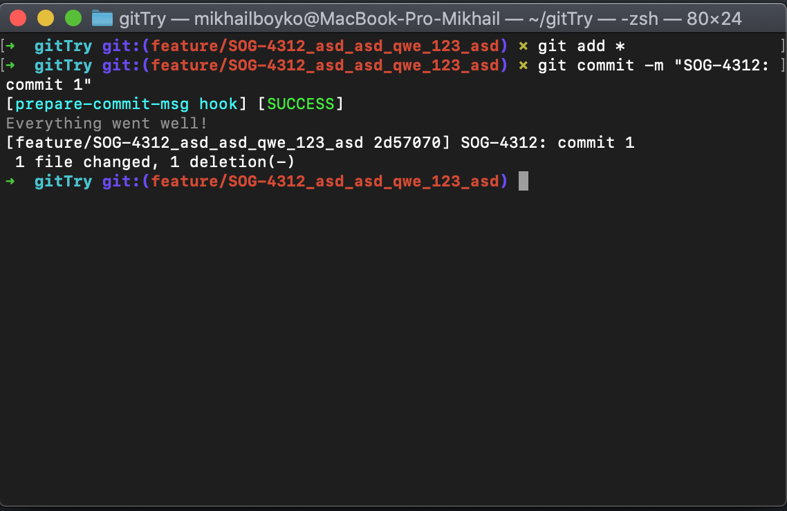
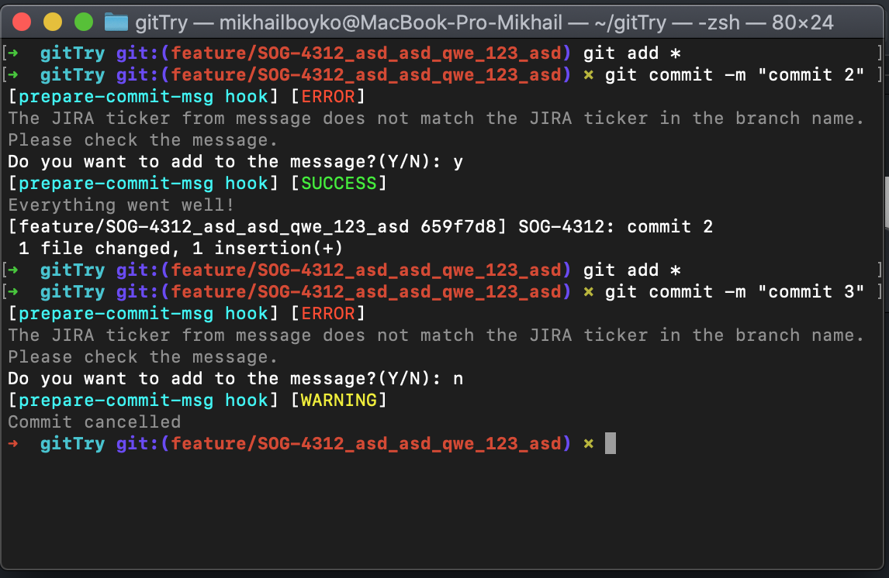
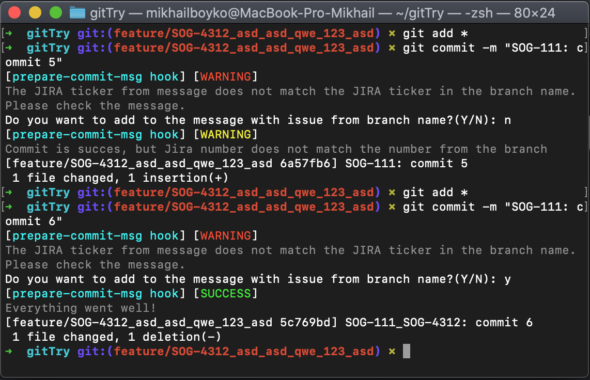
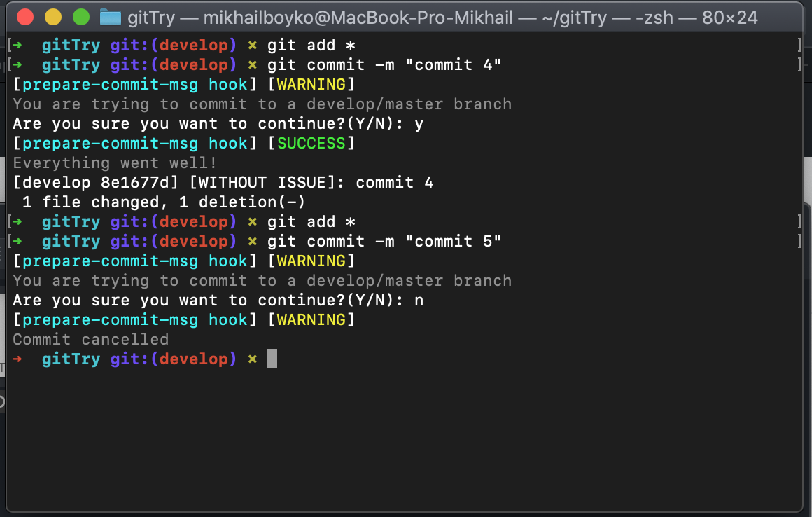
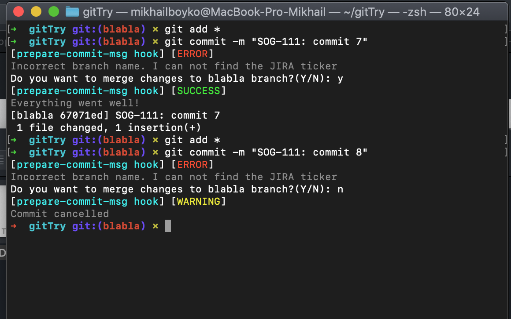
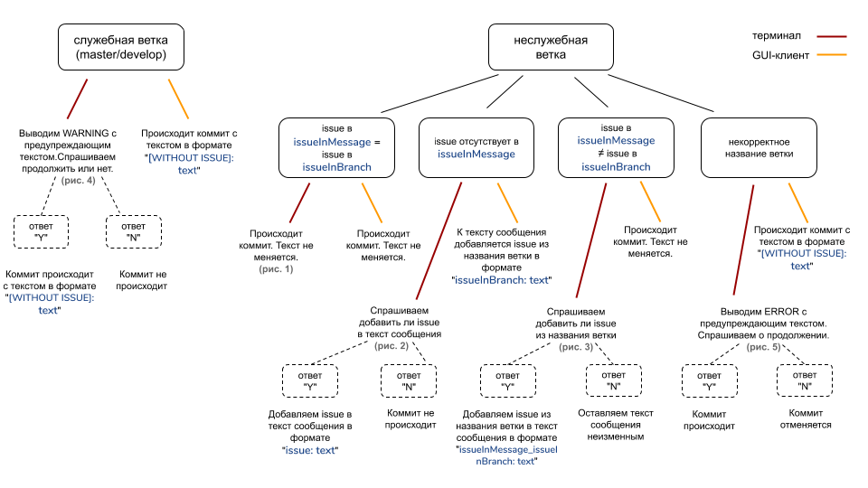

# GitHooks

## Использование:
Скопировать файл "prepare-commit-msg" в папку ./git/hooks Вашего репозитория.
Необходима команда chmod +x prepare-commit-msg в папке с хуками (.git/hooks)
 
## Проверено в следующих GUI-клиентах:
    - Sublime merge
    - Fork
    - Tower
    - SourceTree
    - GitKraken 
    
## Как работает:
<table>
       <thead>
           <tr>
               <th>----</th>
               <th>Название ветки корректно</th>
               <th>Название ветки некорректно</th>
               <th>Название ветки является служебным|</th>
           </tr>
       </thead>
       <tbody>
           <tr>
               <td rowspan=2>Текст в сообщении содержит issue, совпадающий с issue в имени ветки</td>
               <td><b>Терминал:</b> В этом случае происходит коммит и текст не меняется. (рис. 1) </td>
               <td rowspan=2>-</td>
               <td rowspan=2>-</td>
           </tr>
           <tr>
               <td><b>GUI-клиент:</b> В этом случае происходит коммит и текст не меняется.</td>
           </tr>
            <tr>
               <td rowspan=2>Текст в сообщении содержит issue, не совпадающий с issue в имени ветки</td>
               <td><b>Терминал:</b> В этом случае спрашиваем добавить или нет issue из названия ветки. В зависимости от ответа либо добавляем issue из названия ветки в текст сообщения в формате <i>"issueInMessage_issueInBranch: text"</i> (ответ "Y"), либо оставляем текст сообщения неизменным (ответ "N"). (рис. 3)</td>
               <td><b>Терминал:</b> В этом случае выводим ERROR с предупреждающим текстом и спрашиваем продолжить или нет. В зависимости от ответа коммит происходит (ответ "Y"), либо отменяется (ответ "N").  (рис. 5)</td>
               <td><b>Терминал:</b> В этом случае выводим WARNING с предупреждающим текстом и спрашиваем продолжить или нет. В зависимости от ответа, либо коммит происходит с текстом в формате <i>"[WITHOUT ISSUE]: text"</i> (ответ "Y"), либо коммит не происходит (ответ "N"). (рис. 4)</td>
           </tr>
           <tr>
               <td><b>GUI-клиент:</b> В этом случае происходит коммит и текст не меняется.</td>
               <td><b>GUI-клиент:</b> В этом случае происходит коммит с текстом в формате <i>"[WITHOUT ISSUE]: text"</i>.</td>
               <td><b>GUI-клиент:</b> В этом случае происходит коммит с текстом в формате <i>"[WITHOUT ISSUE]: text"</i>.</td>
           </tr>
           <tr>
               <td rowspan=2>Текст в сообщении не содержит issue.</td>
               <td><b>Терминал:</b> В этом случае спрашиваем у пользователя добавить issue в текст сообщения или нет. В зависимости от ответа добавляем issue в текст сообщения в формате <i>"issue: text"</i> (ответ "Y") или коммит не происходит (ответ "N"). (рис. 2) </td>
               <td><b>Терминал:</b> В этом случае выводим ERROR с предупреждающим текстом и спрашиваем продолжить или нет. В зависимости от ответа коммит происходит (ответ "Y"), либо отменяется (ответ "N").  (рис. 5) </td>
               <td><b>Терминал:</b> В этом случае выводим WARNING с предупреждающим текстом и спрашиваем продолжить или нет. В зависимости от ответа, либо коммит происходит с текстом в формате <i>"[WITHOUT ISSUE]: text"</i> (ответ "Y"), либо коммит не происходит (ответ "N"). (рис. 4)</td>
           </tr>
           <tr>
               <td><b>GUI-клиент:</b> В этом случае к тексту сообщения добавляется issue из названия ветки в формате <i>"issueInBranch: text"</i>.</td>
               <td><b>GUI-клиент:</b> В этом случае происходит коммит с текстом в формате <i>"[WITHOUT ISSUE]: text"</i>.</td>
               <td><b>GUI-клиент:</b>В этом случае происходит коммит с текстом в формате <i>"[WITHOUT ISSUE]: text"</i>.</td>
           </tr>
       </tbody>
</table>
    
## Изображения работы:

| | |
|:-------------------------:|:-------------------------:|
|  <figure style="display:inline-block; border: 1px dotted gray;">  <figcaption style="text-align:center">рис. 1</figcaption> </figure> |  <figure style="display:inline-block; border: 1px dotted gray;"><figcaption style="text-align:center">рис. 2</figcaption> </figure> 
| <figure style="display:inline-block; border: 1px dotted gray;">  <figcaption style="text-align:center">рис. 3</figcaption> </figure> | <figure style="display:inline-block; border: 1px dotted gray;">  <figcaption style="text-align:center">рис. 4</figcaption> </figure> 
| <figure style="display:inline-block; border: 1px dotted gray;">  <figcaption style="text-align:center">рис. 5</figcaption> </figure> |  |

## В виде схемы:

    <figure style="display:inline-block; border: 1px dotted gray;">
        
    </figure>

    

## Дополнительная фича:
- Если в тексте сообщения указана issue строчными буквами, то хук автоматически меняет их на заглавные.
